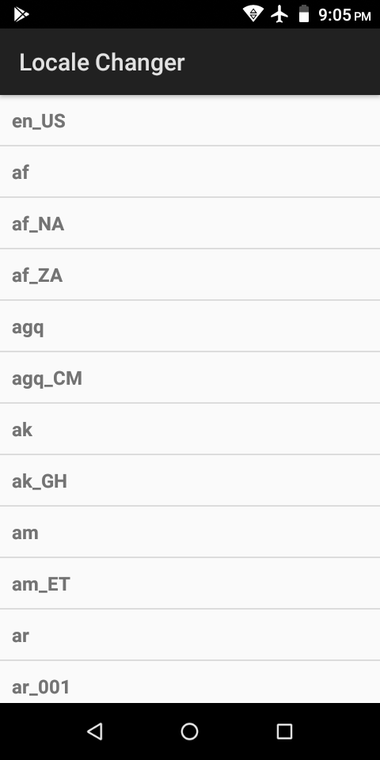

### [Locale Changer](https://github.com/warren-bank/Android-Locale-Changer)

Android app to change the default system-wide locale.

#### Overview:

* displays a list of all available locales
  - clicking on any list item changes the Android system locale to the selected value
    * changes are persistent
* the currently active locale is always positioned as the first list item

#### Screenshots:

#### Required Permissions:

* `android.permission.CHANGE_CONFIGURATION`
  - &lt; Android 4.2
    * protection level: "dangerous"
    * granted by Android manifest
  - &gt;= Android 4.2
    * protection level: "system|signature|development"
    * granted by command-line: `adb shell "pm grant com.github.warren_bank.locale_changer android.permission.CHANGE_CONFIGURATION"`

#### Other Technical Details:

* minSDK = 3 (Android 1.5 Cupcake)
* no root

#### Legal:

* copyright: [Warren Bank](https://github.com/warren-bank)
* license: [GPL-2.0](https://www.gnu.org/licenses/old-licenses/gpl-2.0.txt)
